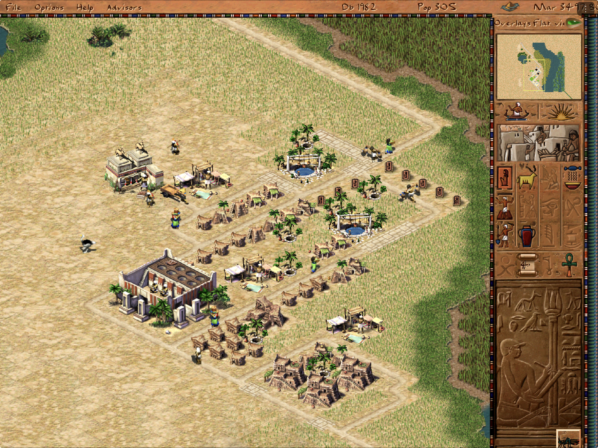
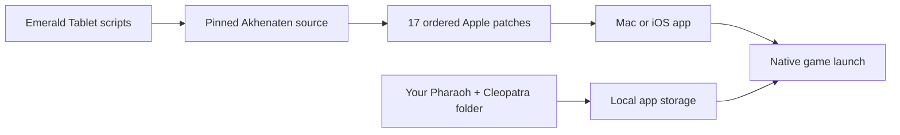

# Emerald Tablet

<p align="center">
  <strong>Pharaoh + Cleopatra on iPad, iPhone, and Apple Silicon Mac, powered by Akhenaten.</strong><br>
  Built for iPadOS · touch and Apple Pencil · bring your own game data
</p>

<p align="center">
  
  
  
  
</p>



Emerald Tablet brings the original 1999 *Pharaoh + Cleopatra* to Apple devices
through the open-source [Akhenaten](https://github.com/dalerank/Akhenaten)
engine. Its primary experience is landscape iPadOS, with touch navigation,
Apple Pencil construction, crisp scaling, native game-speed controls, and a
small persistent controls menu. The same source also builds for iPhone and
Apple Silicon Mac.

This repository contains the Apple integration, ordered Akhenaten patch queue,
tests, and reproducible build scripts. It does **not** contain Pharaoh,
Cleopatra, saved games, or any other original game data. You must supply your
own legally obtained compatible files.

> [!IMPORTANT]
> Emerald Tablet is a **developer preview**. The accepted physical-iPad build
> can navigate, construct one- and multi-tile buildings, cancel build tools,
> adjust game speed, and save. Physical-iPhone testing, audible-output and
> interruption checks, long-session performance, and broad campaign acceptance
> remain open. The first unsigned IPA is available from GitHub Releases for
> personal re-signing; no App Store listing or public TestFlight exists.

[Install status](#install-status) · [Get started](#get-started) ·
[Touch and Pencil](#touch-and-apple-pencil-controls) · [What works](#what-works) ·
[FAQ](#frequently-asked-questions) · [Compatibility](docs/COMPATIBILITY.md) ·
[Project status](STATE.md)

## Install status

| Option | Status | What to do |
|---|---|---|
| Developer-preview IPA | **Available with a computer** | Download [preview 0.1.0 build 1](https://github.com/chrissotraidis/emeraldtablet/releases/tag/v0.1.0-preview.1), then re-sign it with your own Apple ID using a supported sideloading tool. |
| Physical iPad or iPhone | **Developer build available** | Build and sign with your own Apple development team. iPad is the physically tested experience; iPhone remains a smaller-screen preview. |
| iPhone or iPad Simulator | **Available** | Build without signing for development and UI testing. Simulator evidence is not physical-device acceptance. |
| Apple Silicon Mac | **Available** | Build the self-contained arm64 app and select your own Pharaoh + Cleopatra folder. |
| App Store / TestFlight | **Not announced** | No listing or public TestFlight exists. These paths require separate signing, policy, rights, and release review. |

The current development build has been signed, installed in place, and played
on a 12.9-inch iPad Pro (6th generation) running iPadOS 26.6. The accepted
hands-on pass covers Apple Pencil movement, long-press construction
cancellation, game-speed controls with a visible percentage, Hunting Lodge,
Road, Granary, and Bazaar placement, and the Save Game flow. Existing saves
and preferences were preserved byte-for-byte across the update.

## Get started

You need:

- a Mac with full Xcode and its command-line tools;
- CMake 3.25+ and Ninja;
- an Apple ID configured in Xcode for a physical-device build; and
- your own legally obtained copy of the **1999 Pharaoh + Cleopatra** release.

Clone the complete source tree:

```sh
git clone --recurse-submodules https://github.com/chrissotraidis/emeraldtablet.git
cd emeraldtablet
scripts/apply-patches.sh
```

### Apple Silicon Mac

```sh
scripts/build-macos.sh
scripts/audit-macos-app.sh build/macos/akhenaten.app
open build/macos/akhenaten.app
```

Select your Pharaoh + Cleopatra installation folder when prompted. The Mac
build uses ordinary mouse and keyboard controls and does not include the
iPad-only Pencil, touch, document-picker, or native three-dot menu paths.

See the complete [macOS guide](docs/INSTALL_MACOS.md) for prerequisites,
launch options, data setup, and package verification.

### iPhone or iPad Simulator

```sh
scripts/build-ios-sim.sh
scripts/audit-ios-app.sh \
  build/ios-sim/RelWithDebInfo-iphonesimulator/akhenaten.app
```

Boot exactly one Simulator, then install and launch the app:

```sh
xcrun simctl boot "<UDID>"
xcrun simctl install "<UDID>" \
  build/ios-sim/RelWithDebInfo-iphonesimulator/akhenaten.app
xcrun simctl launch "<UDID>" mt.dalerank.akhenaten
```

### Physical iPhone or iPad

Set `IOS_PROVISIONING_PROFILE` and `IOS_CODE_SIGN_IDENTITY`, then run:

```sh
scripts/build-ios-device.sh
```

The development app installs in place, so the measured update path preserves
the app's Documents and preferences. Never uninstall the app or remove its
content when you are trying to preserve imported data or saves. Follow the
[iOS installation guide](docs/INSTALL_IPA.md) for signing, sideloading, and
backup details.

## First launch on iPhone or iPad

Emerald Tablet never downloads or bundles game data.

1. Build or install the app, then launch it once.
2. At **Game Data Required**, choose your Pharaoh + Cleopatra installation
   folder through the Files picker.
3. Leave the app open while it validates and copies the folder into its
   sandbox. The import is staged before it replaces any live data directory.
4. Start with **Play Pharaoh/Cleopatra → Create Family → Begin Family History
   → Predynastic → Nubt**.
5. Open the native **⋮ → Touch help** sheet at any time for the same route and
   the current gesture reference.

Your imported files and saves remain in the app's Files-visible Documents
container. Back up that container before changing signing identities or using
an install tool whose update behavior you have not verified.

## Touch and Apple Pencil controls

| Gesture or control | Action |
|---|---|
| Tap | Select, place, or press an in-game control |
| One-finger or Pencil drag | Pan the city map |
| Two-finger drag | Pan more slowly with shorter inertia, including while a build tool is selected |
| Pinch | Zoom with reduced iPad sensitivity |
| Finger long press or two-finger tap | Inspect or cancel the active action |
| Pencil tap on the selected build tool | Cancel that tool and return to navigation |
| Pencil side double tap or squeeze | Perform the secondary action when enabled in iPadOS |
| Native **⋮** menu | Pause or resume, change speed, read the current speed percentage, cancel a build tool, toggle crisp scaling, open game options, or show help |
| **Options → Pencil mode ON** | Pencil selects and places; fingers navigate without accidental construction |

Traditional touch is the default. Pencil mode gives Apple Pencil a distinct
input identity while keeping finger pan and pinch available. Crisp scaling is
enabled by default for the sharpest presentation and remains user-toggleable.

## What works

| Area | Current result |
|---|---|
| Native Apple builds | Self-contained arm64 macOS app plus one arm64 iOS/iPadOS target with a minimum iOS version of 15.0 |
| Game setup | Native Files picker imports a user-provided folder through a staged, validated copy |
| Rendering | Metal-backed full-screen city rendering; iPad mini, 11-inch, and 13-inch Simulator layouts measured |
| Touch and Pencil | Pan, zoom, selection, construction, cancellation, native controls, and distinct Pencil mode implemented |
| Construction | Physical iPad accepted one-tile and multi-tile placement, including Hunting Lodge, Road, Granary, and Bazaar |
| Saves | Akhenaten format-189 saves load across Mac and iOS; background autosave and in-place preservation are implemented |
| Packaging | Repository and package audits reject original game data, saves, generated apps, signing material, and private evidence |

The compatibility sample loaded 22 of 22 selected early, middle, late,
Cleopatra, and custom maps. That is a reachability sample, not a claim that
every mission or every original save works. Two tested original-1999 saves
remained unsuitable for play, so native Akhenaten format-189 saves are the
supported path. Read the exact measured boundary in
[Compatibility](docs/COMPATIBILITY.md).

The expanded hermetic suite currently reports `195 passed, 2 failed`. The two
failures are documented upstream timing-sensitive kingdom-favour tests; all
three downstream synthetic regression tests pass. Build, install, process,
render, gameplay, input, audio, save, and lifecycle evidence are tracked
separately in [STATE.md](STATE.md) and [`docs/validation/`](docs/validation/).

## Supported game

| Game | Status |
|---|---|
| **Pharaoh + Cleopatra (1999)** | Required and supported at the documented developer-preview compatibility level |
| **Pharaoh: A New Era** | Not supported |

You can buy the compatible original release from
[Steam](https://store.steampowered.com/app/564530/Pharaoh__Cleopatra/) or
[GOG](https://www.gog.com/en/game/pharaoh_cleopatra). The selected folder must
contain at least:

```text
campaign.txt
Data/
```

Nothing in Emerald Tablet grants access to those files or replaces a lawful
copy of the original game.

## Reproducible and data-free



Akhenaten is pinned at
`38cb947ead3895408ea32f74fda6e37921a42bd3`. The Apple work is maintained as
17 ordered patches under [`patches/akhenaten/`](patches/akhenaten/), rather
than as an opaque edited engine checkout. Run the safety gate before every
commit or package:

```sh
scripts/check-repo-safety.sh
```

The build never reads game data from `ref/`, and generated apps and packages
remain ignored. The first public IPA is an unsigned iPhoneOS package for
personal re-signing, not an App Store or TestFlight artifact.

<details>
<summary><strong>Validation and troubleshooting</strong></summary>

<br>

- Full iOS Simulator rebuilds can take 30 to 45 minutes. For source-only
  iteration, use `cmake --build build/ios-sim --config RelWithDebInfo`.
- If a pinned dependency download fails, restore network access and retry. A
  mismatched archive is rejected.
- If the engine checkout no longer matches the patch queue, reconstruct it
  with `git submodule update --init --force engines/akhenaten` followed by
  `scripts/apply-patches.sh`.
- Keep exactly one Simulator booted during validation.
- Run `scripts/run-macos-hermetic.sh` for the engine suite and read the current
  expected boundary in `STATE.md`; do not convert known failures into passes.
- Use `scripts/audit-upstream-patches.sh /path/to/Akhenaten <ref>` to measure
  the ordered queue against another upstream revision without changing the
  pinned checkout.

</details>

## Frequently asked questions

<details>
<summary><strong>Where is the IPA?</strong></summary>

[Download the unsigned developer-preview IPA from GitHub Releases](https://github.com/chrissotraidis/emeraldtablet/releases/tag/v0.1.0-preview.1).
It is an arm64 iPhone/iPad package for personal re-signing. It is not an App
Store, TestFlight, or AltStore PAL release, and it contains no game data.
</details>

<details>
<summary><strong>Does this repository include Pharaoh or Cleopatra?</strong></summary>

No. You must provide your own legally obtained compatible installation. Do not
open issues requesting game data, saved games, extracted assets, or download
links.
</details>

<details>
<summary><strong>Is Emerald Tablet an emulator?</strong></summary>

No. Emerald Tablet is a native Apple wrapper around the open-source Akhenaten
engine. Akhenaten reimplements the game runtime but still requires the original
Pharaoh + Cleopatra data files.
</details>

<details>
<summary><strong>Which version of Pharaoh do I need?</strong></summary>

Use the original 1999 *Pharaoh + Cleopatra* release. *Pharaoh: A New Era* is a
different game and its files are not compatible.
</details>

<details>
<summary><strong>How do I stop placing roads or buildings?</strong></summary>

Long press the map, use a deliberate two-finger tap, tap the already-selected
tool again with Apple Pencil, or choose **⋮ → Cancel build tool**. All four
paths clear the active construction action.
</details>

<details>
<summary><strong>How do I see or change game speed?</strong></summary>

Open the native **⋮** menu. It shows the current speed as a percentage and
provides repeatable **Speed −** and **Speed +** controls.
</details>

<details>
<summary><strong>Will my saves survive an update?</strong></summary>

They survived the measured in-place physical-iPad updates byte-for-byte. That
does not make every sideloading tool or signing-identity change safe. Back up
the Files-visible Documents container, install in place, and do not uninstall
or remove existing content when preservation matters.
</details>

<details>
<summary><strong>Can I load original 1999 save files?</strong></summary>

Akhenaten can parse some original saves, but Emerald Tablet does not claim
broad playable compatibility. Both private legacy saves used in the current
test pass exposed serious simulation or routing problems. Use Akhenaten's
format-189 saves for supported play and keep irreplaceable originals backed up.
</details>

<details>
<summary><strong>Does audio work?</strong></summary>

Audio initialization and playback are confirmed on Mac, and the physical iPad
build reaches the expected audio-engine paths. Audible output from the intended
physical route, headphones, Bluetooth, and interruption recovery still need a
complete hands-on matrix, so they are not yet claimed as accepted.
</details>

<details>
<summary><strong>Is this an App Store or TestFlight release?</strong></summary>

No. App Store, TestFlight, AltStore PAL, and other hosted binary channels are
separate release projects with their own signing, policy, rights, and review
requirements.
</details>

## Project map

| Path | Purpose |
|---|---|
| [`patches/akhenaten/`](patches/akhenaten/) | Ordered Apple and compatibility changes applied to the pinned engine |
| [`scripts/`](scripts/) | Build, audit, package, patch, and safety automation |
| [`docs/INSTALL_MACOS.md`](docs/INSTALL_MACOS.md) | Complete Apple Silicon Mac setup |
| [`docs/INSTALL_IPA.md`](docs/INSTALL_IPA.md) | iOS signing, installation, and preservation guidance |
| [`docs/COMPATIBILITY.md`](docs/COMPATIBILITY.md) | Measured game, map, and save boundary |
| [`docs/RELEASE_CHECKLIST.md`](docs/RELEASE_CHECKLIST.md) | Source and binary publication gates |
| [`docs/UPSTREAM_SYNC.md`](docs/UPSTREAM_SYNC.md) | Patch ownership and upstream drift policy |
| [`docs/validation/`](docs/validation/) | Evidence summaries, with private captures excluded |
| [`STATE.md`](STATE.md) | Current gate status and experiment ledger |
| [`RIGHTS_AND_LICENSES.md`](RIGHTS_AND_LICENSES.md) | Rights, licensing, and distribution boundary |

The hero image was captured from the accepted physical-iPad build on August
24, 2026. Its original game data was supplied locally and is not part of this
repository.

## Legal and acknowledgements

Emerald Tablet is an unofficial community project. It is not affiliated with
or endorsed by Activision, Impressions Games, or the Akhenaten, Julius, or
Augustus projects. Pharaoh, Cleopatra, and related copyrights and trademarks
belong to their respective owners.

Akhenaten and the Emerald Tablet engine modifications are distributed under
the [GNU Affero General Public License v3.0](LICENSE). Each dependency retains
its own copyright and license. See the complete
[rights and licensing boundary](RIGHTS_AND_LICENSES.md) and
[third-party notices](THIRD_PARTY_NOTICES.md).
